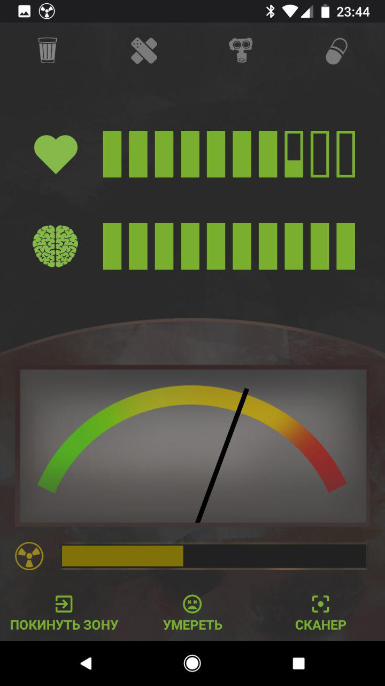

# Svalker
This is augmented reality application for Airsoft Role Playing Games(ARPG) inspired by S.T.A.L.K.E.R universe.

It works in a pair with a special hardware which converts radio signals audio signals. During a game, different radio beacons are put in place around a game area and this determines places of Anomalies by game conventions.

The application reads audio signal from 3.5 audio jack and analyses signal using Fast Fourier Transform(FFT). Data bunching and proceeding implemented mostly with RxJava.

